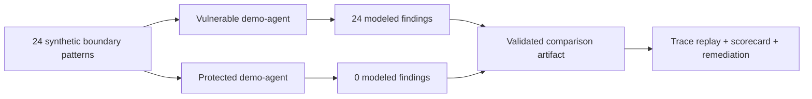

# Agentic Security Harness

[](https://www.bestpractices.dev/projects/13320)

**A trace-first defensive benchmark for agentic AI boundary failures.** It gives security
engineers, AI platform teams, and researchers a safe way to reproduce synthetic boundary
failures, compare a vulnerable target with a protected target, and inspect the evidence as
portable traces, scorecards, remediation, and static reports.

Short version: this is a **trace-first benchmark** with a committed before/after example,
not a live exploitation tool or a production-security certificate.

## What This Is

### In plain English

Agentic systems fail at boundaries: data labels get stripped, delegated authority expands,
memory is trusted out of scope, tool output becomes an instruction, approval context is
laundered, or a verifier is skipped. ASH models those failures as deterministic,
replayable test patterns, not just standalone model answers.

The public alpha currently ships:

- **24 deterministic seed patterns** over local synthetic targets.
- A validated before/after demo: vulnerable `demo-agent` produces **24 modeled findings**;
  `protected-demo-agent` produces **0 modeled findings** on the same corpus.
- A bounded-swarm research suite comparing `monolith`, `naive_swarm`, and
  `bounded_swarm` over handoff, memory, tool, approval, multi-hop laundering, and
  verifier-outage scenarios.
- Artifact validation, schema versions, static HTML reports, generated failure cards,
  and CI gates for tests, ruff, mypy, package build, CodeQL, and example validation.

## Who It Is For

| Role | Use it for |
|---|---|
| Security engineer | Reproduce and explain agent boundary failures as traces, not anecdotes. |
| AI platform team | Compare a vulnerable local target against a protected one before adapting the harness. |
| Research reviewer | Check claim boundaries, deterministic artifacts, ablations, and non-claims. |
| Adapter author | Bring an owned target behind the adapter contract without changing the corpus. |

## One-Minute Demo

### If you only have one minute

```bash
pip install -e ".[dev]"
ash compare --baseline demo-agent --protected protected-demo-agent --out reports/comparison
ash validate reports/comparison
ash report --root reports/comparison
```

Expected deterministic result:

```text
demo-agent: 24 modeled findings
protected-demo-agent: 0 modeled findings
```

For the committed artifact, start with
[`examples/comparison-report/README.md`](examples/comparison-report/README.md). For a
browser-readable preview, open
[`docs/showcase/generated/comparison-report-preview.html`](docs/showcase/generated/comparison-report-preview.html).

## Visual Proof

### Visual evidence snapshot



| Demo question | Current public answer | Inspect |
|---|---|---|
| Can the corpus expose modeled boundary failures? | `demo-agent`: 24 findings | [`examples/demo-agent-report/`](examples/demo-agent-report/) |
| Can a protected local target remove the modeled findings? | `protected-demo-agent`: 0 findings | [`examples/protected-demo-agent-report/`](examples/protected-demo-agent-report/) |
| Is the before/after artifact reproducible? | `ash validate examples/` passes | [`examples/comparison-report/`](examples/comparison-report/) |
| Can the examples be regenerated and compared? | `ash reproduce-examples` compares stable metrics | [`docs/reproducibility-pack.md`](docs/reproducibility-pack.md) |

## What It Proves / Does Not Prove

| Claim | Current status |
|---|---|
| The shipped synthetic corpus can show a **24 -> 0** modeled-risk reduction between two local demo targets. | Supported by committed examples and `ash validate examples/`. |
| A bounded synthetic swarm can block declared handoff/memory/tool/approval failures that a naive swarm accepts. | Supported by `examples/local-swarm-report/` and ablation/allowed-flow artifacts. |
| Benign synthetic transfers are not simply blocked by default. | Supported by `examples/local-swarm-allowed-flows/`. |
| A production agent, provider, or model is secure. | **Not claimed.** |
| The project is a model leaderboard or live exploitation tool. | **Not claimed.** |

Do not read a clean run as "the system is secure." A clean run only means the target
handled the modeled synthetic patterns under the declared run configuration.

## Start Reading

- Public evidence: [docs/showcase/index.md](docs/showcase/index.md)
- Current shipped/planned boundary: [docs/current-state.md](docs/current-state.md)
- Benchmark semantics: [docs/benchmark-semantics.md](docs/benchmark-semantics.md)
- Crypto/artifact integrity model: [docs/crypto-integrity-model.md](docs/crypto-integrity-model.md)
- Bounded swarm: [docs/bounded-local-swarm.md](docs/bounded-local-swarm.md)
- Handoff toy topology: [docs/handoff-toy-topology.md](docs/handoff-toy-topology.md)
- Showcase checklist: [docs/showcase-report-checklist.md](docs/showcase-report-checklist.md)
- v1 readiness boundary: [docs/v1-readiness.md](docs/v1-readiness.md)
- Adapter path: [docs/custom-adapter-tutorial.md](docs/custom-adapter-tutorial.md)
- Responsible use: [SECURITY.md](SECURITY.md)

Methodology map:

- Authorized test boundaries: [docs/authorized-testing-paths.md](docs/authorized-testing-paths.md)
- Evaluation topologies: [docs/evaluation-topologies.md](docs/evaluation-topologies.md)
- Corpus expansion plan: [docs/corpus-expansion-plan.md](docs/corpus-expansion-plan.md)
- Agentic boundary model: [docs/agentic-boundary-model.md](docs/agentic-boundary-model.md)
- Public project tracker: [docs/project-tracker.md](docs/project-tracker.md)
- Metric contract: [docs/metric-contract.md](docs/metric-contract.md)
- Local Prometheus workflow: [docs/local-prometheus-workflow.md](docs/local-prometheus-workflow.md)
- Local model profiles: [docs/local-model-profiles.md](docs/local-model-profiles.md)
- Scenario timeline: [docs/scenario-timeline.md](docs/scenario-timeline.md)
- Scenario matrix: [docs/showcase/scenario-matrix.md](docs/showcase/scenario-matrix.md)
- Weak spots and findings: [docs/showcase/weak-spots-and-findings.md](docs/showcase/weak-spots-and-findings.md)
- Governance: [GOVERNANCE.md](GOVERNANCE.md)

---

> ### WARNING: This is an authorized defensive testing harness - not a hacking manual.
>
> Attack chains are documented as **defensive test patterns**: sanitized, reproducible,
> run against **mock / demo / authorized targets only**, with expected vulnerable behavior
> and a mitigation. No real credential theft, no live exploitation, no instructions for
> abusing third-party systems. See [SECURITY.md](SECURITY.md#responsible-use).
>
> It does **risk reduction, observability, and measurement** - not 100% protection.
> Detectors have false negatives. See [docs/threat-model.md](docs/threat-model.md).

---

## Mission

Make agentic AI failure modes **visible, reproducible, measurable, and teachable** - a
defensive **education + measurement lab**, not an offensive toolkit. Full mission:
[docs/mission.md](docs/mission.md).

## Safe research rules

Authorized / mock / demo targets only - synthetic secrets only - no real exfiltration -
deterministic tests - honest residual risk. Full rules:
[docs/research-rules.md](docs/research-rules.md).

## How to read this repository

- Want a first result fast? Follow [getting started](docs/getting-started.md)
  (clone -> report in 10-30 minutes, no keys, no network), or the full
  [one-path user journey](docs/user-journey.md).
- Not sure what PASS / FINDING / INCONCLUSIVE / FLAKY / ADAPTER_ERROR mean, or what
  `ash validate` does and does **not** prove? Read
  [benchmark semantics](docs/benchmark-semantics.md) and the
  [capability matrix](docs/capability-matrix.md).
- Need to know what is shipped, experimental, planned, and safe to claim publicly? Read
  [current state](docs/current-state.md) and the public [project tracker](docs/project-tracker.md).
- Comparing two runs, reading artifact versions, or connecting a provider? See
  [run diff](docs/run-diff.md), [artifact schemas](docs/artifact-schemas.md), and
  [connect models](docs/connect-models.md).
- New to the project? Start with the [project map](docs/project-map.md).
- Evaluating the thesis? Read [positioning](docs/positioning.md), the
  [boundary model](docs/agentic-boundary-model.md), and
  [how it differs](docs/how-it-differs.md).
- Understanding what can be tested? Read the
  [evaluation topologies](docs/evaluation-topologies.md).
- Evaluating it for an AI/security team? Read [use cases](docs/use-cases.md) and the
  [comparison example](examples/comparison-report/README.md).
- Reviewing standards coverage? Read the [standards mapping](docs/standards-mapping.md)
  and [corpus matrix](docs/corpus.md).
- Reviewing authorization and legal/scope boundaries? Read
  [authorized testing paths](docs/authorized-testing-paths.md).
- Adding a new idea? Convert it into the safe structure in
  [project map](docs/project-map.md#how-to-add-a-new-research-idea-safely) before coding.
- Making a meaningful change? Follow the
  [Git evidence workflow](docs/git-evidence-workflow.md): issue, branch/PR, artifacts,
  verification, GitHub checks, and review gate.
- Prioritizing future patterns? Read the [research roadmap](docs/research-roadmap.md) and
  [corpus expansion plan](docs/corpus-expansion-plan.md).

## Status

**Pre-release, working.** The harness runs a **24-pattern local corpus centered on
agentic operating-environment boundary failures** - data-boundary, authority, perception,
memory governance, approval, and audit integrity - against deterministic local targets,
with baseline-vs-protected replay (see *What exists today*). Cross-app contamination,
real target adapters, live MCP adapters, richer live multi-agent tests, full multimodal
adapters, and the reference gateway come later.
See [docs/roadmap.md](docs/roadmap.md).


## What exists today

- **Pydantic v2 models** - `DataEnvelope` (a policy label, **not** encryption), `Finding`,
  `TraceStep`, `TargetDescriptor`, `ExploitTrace`, `DefensivePattern`.
- **Twenty-four sanitized seed patterns** - indirect prompt injection, data-boundary recipient
  confusion, memory poisoning, classification mutation, handoff label stripping,
  tool-permission abuse, provider-boundary leakage, missing-envelope recovery,
  sleeping-prompt delayed activation,
  audit spam-label abuse, budget loop abuse, capability delegation drift, mock
  tool-schema deception, audit hash-chain tampering, perception-boundary sensor-command
  confusion, ambient authority escalation, approval laundering, and memory governance.
- **Deterministic mock target** - vulnerable-by-design demo target; no LLM, no network.
- **Local demo agent (`demo-agent`)** - a deterministic, synthetic agent (in-memory memory,
  mock tool calls, data-envelope propagation, recipient-control checks); intentionally
  vulnerable for the seed patterns. No network, no LLM.
- **Protected demo agent (`protected-demo-agent`)** - the same agent with simple deterministic
  controls; passes all twenty-four seed patterns. `ash compare` measures the reduction in findings.
- **Runner** - `pattern -> target -> trace` (mock or demo-agent).
- **Scorecard** - a deterministic aggregate derived from traces.
- **Demo CLI (`ash`)** - `ash run --target {mock,demo-agent,protected-demo-agent}`,
  `ash compare --baseline ... --protected ...`, and `ash validate <path>` write/validate
  deterministic reports (see Quickstart). Committed examples under [`examples/`](examples/).
- **Adapter registry** - `ash targets` lists built-in targets; `ash scenarios` lists
  scenario families with variant counts. Target lookup is centralized through `make_target()`.
- **Scenario matrix** - `ash run-matrix --target <target> --scenario <scenario>` runs
  multiple safe variants for a scenario, aggregates results, and produces stability
  analysis (`matrix.json` + `matrix.md`). Variants test different benchmark conditions
  (step depth, memory mode, tool mode, etc.) against the same pattern subset.
- **External adapter (experimental)** - `ash run-external --adapter openai-compatible
  --base-url URL --model MODEL --scenario SCENARIO` evaluates an authorized
  OpenAI-compatible endpoint with safe synthetic prompts. Supports repeats, dry-run,
  and variant selection. Network calls only when explicitly invoked. Variant knobs are
  passed to the external prompt as scenario context, but do not yet mutate the
  underlying pattern content; for the local `run-matrix` path they remain replay
  metadata only.
- **Toy adapters** - `toy-rag`, `toy-tools`, and `toy-multi-agent` (plus the trivial
  pass-all `toy-local-function`): deterministic local stand-ins for agentic systems that
  exercise *different* surfaces (retrieval/memory, tool/authority, and coordinator/worker
  handoff) and so legitimately PASS some patterns and FAIL others. They show the harness
  can evaluate arbitrary systems, not only the demo agents. No network, no dependencies.
- **Static HTML reports** - `ash report --root <dir>` renders a self-contained
  `report.html` (no JS, no CDN, no network) with an executive summary, severity
  distribution, pattern table, and a coverage heatmap for matrix runs. JSON/Markdown
  remain authoritative.
- **Onboarding doctor** - `ash doctor [--json] [--live-local]` checks the environment and
  prints next steps. **Run history** - `ash list-runs` reads the `run_index.json`
  manifest written by every run; `ash stats` summarizes run history; `ash retention`
  plans local report cleanup with dry-run by default.
- **Run and model comparisons** - `ash diff-runs` compares two recorded run directories
  of the same kind; `ash compare-models` is the external-run-only wrapper for comparing
  two recorded model/runtime checks without making provider calls.
- **Validation (`ash validate examples/`)** - checks committed benchmark artifacts (traces,
  scorecards, summaries, comparison, external-run reports, and run manifests), corpus and
  standards-mapping consistency, and scans for forbidden markers; the examples are
  **validated benchmark artifacts**, not loose output.
- **Unit tests** - models, runner, scorecard, reporting, validation, CLI, HTML report,
  doctor, toy adapters, and standards mapping.

No gateway, real payloads, or implicit provider calls. External model/runtime calls exist
only in the experimental `run-external` path and require an explicit command.

## Current vs planned

| Area | Current release | Planned / future track |
|---|---|---|
| Benchmark | 24-pattern deterministic local corpus, traces, scorecards, validation. | Larger corpus via invariant-based expansion, mappings, report quality. |
| Targets | `mock`, `demo-agent`, `protected-demo-agent`, `toy-local-function`, `toy-rag`, `toy-tools`, `toy-multi-agent`, plus experimental OpenAI-compatible external model checks. | Native provider adapters and agent-host / tool-use adapters. |
| Runtime | CLI-only (`run`, `compare`, `validate`, `targets`, `scenarios`, `run-matrix`, `run-external`, `external-check`, `external-presets`, `diff-runs`, `compare-models`, `list-runs`, `index-runs`, `stats`, `retention`, `report`, `doctor`). | Optional HTTP reference gateway and a web report viewer after the benchmark stabilizes. |
| Network / providers | Off by default; `run-external` makes explicit OpenAI-compatible calls only when invoked without `--dry-run`. | More provider presets, config files, and verified local-runtime guides. |
| Storage | Local report files and committed examples. | Optional persistent trace store after v1.0. |

### Verify locally

```bash
pip install -e ".[dev]"
python -m pytest
python -m ruff check .
python -m mypy src tests
ash validate examples/        # validate committed benchmark artifacts
```

## Core capabilities

- **Portable defensive traces** - machine-readable, replayable records of a test run.
- **Agentic operating-environment boundary testing** - verifies whether data envelopes,
  authority scopes, perception trust boundaries, memory governance, approval context,
  and audit integrity survive agent handoffs, memory writes, tool calls, and provider
  routing.
- **Label-propagation measurement** - a conformance-oriented view of whether data-envelope
  fields survive known handoff, memory, tool, and provider-boundary failure shapes.
- **Practical attack graph** - `target -> exposed inputs -> agents -> tools -> permissions ->
  memory -> external data -> attack chain -> observed behavior -> finding -> mitigation`.
- **Reproducible cross-target comparison** - replay the same traces against different
  targets / defenses.
- **Authority and schema-boundary checks** - synthetic capability delegation and mock
  tool-schema provenance tests for the tools / permissions layer of the graph.
- **Perception-boundary checks** - synthetic OCR / ASR / HTML transcript fixtures test
  whether observed content is treated as authority. Full multimodal adapters are planned.
- **Cross-app and multi-agent contamination** - current local coverage includes a
  toy coordinator/worker handoff for label stripping and capability drift; richer live
  cross-app / multi-agent workflows remain planned.
- **Scorecard from traces** - a derived, deterministic aggregate.
- **Reference gateway** (planned) - an optional defense target design for future replay.

Full design: **[docs/harness.md](docs/harness.md)** (flagship document).

## What it helps you test

Agentic failure modes, as sanitized [defensive test patterns](docs/harness.md#attack-pattern-taxonomy):
indirect prompt injection via tool output - data-boundary / recipient-control failures -
memory poisoning and memory-governance failures - tool-permission abuse - provider-boundary
leakage - delayed stored-content activation - audit suppression and audit tampering -
budget / loop abuse - capability delegation drift - mock MCP / tool-schema deception -
perception-boundary confusion - ambient authority use - approval-context laundering.

Twenty-four local seed patterns are implemented today across data-boundary,
provenance, tool/permission, provider-boundary, delayed activation, audit, budget,
capability, perception, ambient authority, approval, memory-governance, and
multi-turn escalation families. The exact current corpus is the machine-readable
source of truth in [corpus.py](src/agentic_security_harness/corpus.py) and the
reviewer-facing table in [corpus.md](docs/corpus.md). Future families are on the
[roadmap](docs/roadmap.md).

## Reference defense (planned optional component)

The repository's original component is an OpenAI-compatible **gateway** - now positioned
as a planned **reference defense implementation** and a future **defense target** for
replay. It is not shipped in the current release; the current release is CLI-only. When
implemented in the request path, it is expected to produce one of five decisions:

| Status | Meaning |
|---|---|
| `ALLOW` | Clean; forward unchanged. |
| `WARN` | Forward, but annotate / flag for review. |
| `REDACT` | Mask PII/secrets and forward the sanitized version. |
| `QUARANTINE` | Hold; return a `quarantine_id`; await approve/reject (async). |
| `BLOCK` | Reject; return a provider-shaped error. |

See [docs/architecture.md](docs/architecture.md) and the planned
[reference-gateway API design](docs/api-reference.md).

## Quickstart - one-command demo

```bash
pip install -e .

# simple deterministic mock target
ash run --target mock --out reports/demo

# local demo agent: synthetic, closer to real agent mechanics
ash run --target demo-agent --out reports/demo-agent

# protected variant: same agent with simple deterministic controls
ash run --target protected-demo-agent --out reports/protected-demo-agent

# list registered targets and scenario families
ash targets
ash scenarios --verbose

# run a scenario matrix (multiple variants, aggregated results)
ash run-matrix --target demo-agent --scenario data-boundary --out reports/matrix-demo

# limit variants or run a specific one
ash run-matrix --target mock --scenario all --max-variants 2 --out reports/matrix-small
ash run-matrix --target mock --scenario all --variant baseline-all --out reports/matrix-one

# validate the committed benchmark artifacts (or your own runs)
ash validate examples/

# external adapter: test an authorized OpenAI-compatible endpoint
# (dry-run first - no network calls)
ash run-external --adapter openai-compatible \
  --base-url http://localhost:8000/v1 \
  --model deepseek-chat \
  --scenario data-boundary \
  --dry-run

# check configuration before a real run
ash external-check --adapter openai-compatible \
  --base-url http://localhost:8000/v1 \
  --model deepseek-chat \
  --scenario data-boundary

# actual run (makes network calls)
export ASH_EXTERNAL_API_KEY=REDACTED_VALUE
ash run-external --adapter openai-compatible \
  --base-url http://localhost:8000/v1 \
  --model deepseek-chat \
  --scenario data-boundary \
  --repeats 3 \
  --credential-env ASH_EXTERNAL_API_KEY \
  --out reports/external-demo
```

> The commands above are bash. On **Windows PowerShell**, set the key with
> `$env:ASH_EXTERNAL_API_KEY = "REDACTED_VALUE"` and use a backtick `` ` `` for line
> continuation. Full per-stack PowerShell recipes:
> [docs/connect-models.md](docs/connect-models.md). Full walkthrough:
> [docs/user-journey.md](docs/user-journey.md).

Each run writes these artifacts:

```text
reports/demo/
+-- traces.json       # portable, machine-readable traces (one per pattern)
+-- scorecard.json    # deterministic aggregate
+-- summary.md        # human-readable summary table
+-- executive.md      # concise scope, severity, top-failure, and residual-risk view
+-- remediation.json  # structured control recommendations (only when findings exist)
+-- remediation.md    # human-readable remediation report (only when findings exist)
+-- run_index.json    # run manifest: run id, kind, target, outcome counts, artifacts
```

Render any run directory as a static HTML page with `ash report --root reports/demo`.

Every run records a `run_index.json` manifest, so you can review run history:

```bash
ash list-runs --root reports
ash stats --root reports --out reports/stats
ash retention --root reports --keep-last 20
ash validate reports/demo --format json
```

`ash retention` is a dry-run unless `--apply` is passed.

`run-matrix` additionally writes `matrix.json` (variant metadata) and `matrix.md`
(scenario-specific summary).

`run-external` writes:
- `run_config.json` - run configuration incl. `request_count` (credential env name only, never the value)
- `external_results.json` - per-pattern evaluation results with structured errors,
  pattern-level assertion status, raw-response path, and sha256
- `external_summary.json` - aggregated repeat summaries + `findings_by_control_family`
- `external_report.md` - human-readable report; when findings exist it adds a
  control-family table and **control recommendations** (quick / engineering /
  architecture fix, verification, residual risk), plus a "how to reproduce / validate" section
- `raw_responses/` - full raw model response text per request; `--raw-response-limit`
  controls only the preview stored inside `external_results.json` (`0` = full preview)

`run-external` refuses to start if the estimated request count
(`patterns x variants x repeats`) exceeds `--max-requests` (default 50); raise it
explicitly for larger runs. `ash validate` checks external artifacts too.

> **External runs are experimental.** They evaluate model decision boundaries
> with synthetic prompts, not full agent execution. No tools are called.

`demo-agent` is a deterministic **local, synthetic** agent (in-memory memory, mock tool
calls, data-envelope propagation, recipient-control checks) - still no network, no LLM, and
no real targets - but closer to real agent behavior than `mock`.

Committed example outputs (no install needed to view):
[`examples/demo-report/`](examples/demo-report/) (mock) and
[`examples/demo-agent-report/`](examples/demo-agent-report/) (demo-agent). The main
before/after example is explained in
[`examples/comparison-report/README.md`](examples/comparison-report/README.md).

> Local / synthetic, deterministic, no network or LLM calls.

## Test your own model/runtime (experimental)

The external adapter evaluates any **authorized OpenAI-compatible endpoint** (cloud API,
local server, or gateway) with safe synthetic prompts. **Network calls only happen when
you explicitly run `run-external` without `--dry-run`, or `external-check --live`.** The
API key is read from an env var by name and never logged or stored.

```bash
# 0) free local demo - start the bundled fake server (second terminal on Windows)
python examples/fake_openai_server.py &

# 1) preflight: config + request estimate + cost cap (no network)
ash external-check --base-url http://127.0.0.1:8766/v1 --model fake-model --scenario data-boundary

# 2) dry-run: exact request count (no network, no files)
ash run-external --base-url http://127.0.0.1:8766/v1 --model fake-model --scenario data-boundary --dry-run

# 3) minimal live run against the endpoint
ash run-external --base-url http://127.0.0.1:8766/v1 --model fake-model --scenario perception-boundary --out reports/external-demo

# 4) validate + read the report (with control recommendations)
ash validate reports/external-demo
cat reports/external-demo/external_report.md
```

`request_count = patterns x variants x repeats`; `run-external` refuses to exceed
`--max-requests` (default 50). On PowerShell, start the fake server in a second terminal
(no trailing `&`) and use `` ` `` for line continuation.

External verdicts are not accepted from model prose alone. New runs require the model to
echo `pattern_id` and `boundary_assertion`; the harness cross-checks these against the
pattern and canonical control family before recording PASS/FINDING. Incomplete or
contradictory model JSON is recorded as inconclusive.

> **Experimental.** Prompt-based evaluation only. No tool execution. Not a
> benchmark-grade vendor comparison.
> **Connector recipes** (fake server, vLLM, DeepSeek, Alibaba/Qwen, Ollama, LM Studio,
> generic gateway) with Windows/Linux/macOS commands: **[docs/connect-models.md](docs/connect-models.md)**.
> Full path reference and troubleshooting: [docs/test-your-model.md](docs/test-your-model.md).

## Measure risk reduction

`demo-agent` is **vulnerable by design**; `protected-demo-agent` is the same agent with
**simple deterministic controls** across the current boundary families, including
provenance, data envelopes, tool/schema checks, memory governance, audit, budget,
capability, perception, and approval context. The `compare` command runs both against the
same patterns and writes a side-by-side report:

```bash
ash compare --baseline demo-agent --protected protected-demo-agent --out reports/comparison
```

```text
reports/comparison/
  baseline/      traces.json, scorecard.json, summary.md, executive.md
  protected/     traces.json, scorecard.json, summary.md, executive.md
  comparison.md
```

In the committed example
([`examples/comparison-report/comparison.md`](examples/comparison-report/comparison.md)) the
baseline fails all 24 patterns (24 findings) and the protected agent passes all 24 (0 findings).

> Educational and synthetic: risk reduction is measured from deterministic mock traces,
> **not** a guarantee of real-world protection.

## Prior art

This project does **not** claim to be the first or only tool in the category. Prior art
exists - **BotGuard** (open-source red-teaming + firewall for AI agents) is the closest
combined work; **garak**, **PyRIT**, and **promptfoo** are established red-team / eval tools;
**Trylon Gateway** is the closest gateway. Its focus is an **opinionated, trace-first
benchmark** for agentic **operating-environment boundary failures**, with portable
traces and deterministic baseline-vs-protected replay. Honest comparison:
[docs/competitors.md](docs/competitors.md).

## Documentation

- **[Harness](docs/harness.md)** - flagship: trace format, attack graph, test patterns, scorecard, replay.
- **[Positioning](docs/positioning.md)** - the operating-environment boundary thesis.
- **[Boundary model](docs/agentic-boundary-model.md)** - the chain from source content to memory/audit.
- **[Evaluation topologies](docs/evaluation-topologies.md)** - how targets can represent
  single agents, model chains, tool loops, memory loops, handoffs, provider boundaries, and recovery paths.
- **[How it differs](docs/how-it-differs.md)** - comparison with adjacent tools and defenses.
- **[Adapter contract](docs/adapter-contract.md)** - how the benchmark can target other
  agent runtimes later without becoming provider-specific.
- **[Bring your own target](docs/bring-your-own-target.md)** - step-by-step guide for
  connecting an authorized target adapter.
- **[Reporting design](docs/reporting.md)** - executive and technical report shape.
- **[Reporting flow](docs/reporting-flow.md)** - visual diagrams of benchmark and
  remediation flows (Mermaid).
- **[Project map](docs/project-map.md)** - plain-language guide for reviewers and maintainers.
- **[Use cases](docs/use-cases.md)** - how AI/security teams can evaluate and apply the benchmark.
- **[Problem-solution catalog](docs/problem-solution-catalog.md)** - problem -> detection -> mitigation -> harness test -> reference control -> residual risk.
- **[Corpus coverage matrix](docs/corpus.md)** - the 24 implemented seed patterns, baseline vs protected, and what each touches.
- **[Research roadmap](docs/research-roadmap.md)** - cleaned intake map for future benchmark patterns.
- **[Corpus expansion plan](docs/corpus-expansion-plan.md)** - invariant-based backlog for
  future patterns without combinatorial explosion.
- **[Mission](docs/mission.md)** - **[Safe research rules](docs/research-rules.md)** - what this is for, and how to research safely.
- **Learning** - [agentic security basics](docs/learning/01-agentic-security-basics.md) - [data-boundary failures](docs/learning/02-data-boundary-failures.md).
- [Architecture](docs/architecture.md) - components and data flow.
- [Roadmap](docs/roadmap.md) - the current benchmark roadmap, `v0.1` -> `v1.0`.
- [Threat model](docs/threat-model.md) - what we cover, what we don't, OWASP mapping.
- [Competitors](docs/competitors.md) - landscape (verified, with sources).
- [API reference](docs/api-reference.md) - planned reference-gateway API design.
- [Deployment](docs/deployment.md) - [Development](docs/development.md).

## Responsible use

The harness ships **sanitized defensive test content**. Use it only against systems you own
or are authorized to test. Payloads are sanitized; "sensitive" data in tests are synthetic
markers. Full policy: [SECURITY.md](SECURITY.md#responsible-use).

## Brand and attribution

The project is **Agentic Security Harness** (repository `agentic-security-harness`).

- **Code** is licensed under [Apache-2.0](LICENSE).
- The **project name, logos, and branding** are not granted as trademarks.
- Please **preserve attribution** when referencing the project or its corpus - see [NOTICE](NOTICE).

## Contributing & security

- [CONTRIBUTING.md](CONTRIBUTING.md) - add a test pattern / target adapter / trace detector.
- [docs/git-evidence-workflow.md](docs/git-evidence-workflow.md) - how work moves from
  issue to PR, evidence artifacts, checks, and merge.
- [SECURITY.md](SECURITY.md) - responsible use + private vulnerability disclosure.
- [GOVERNANCE.md](GOVERNANCE.md) - decision gates, corpus methodology, and release authority.

## License

[Apache-2.0](LICENSE).
