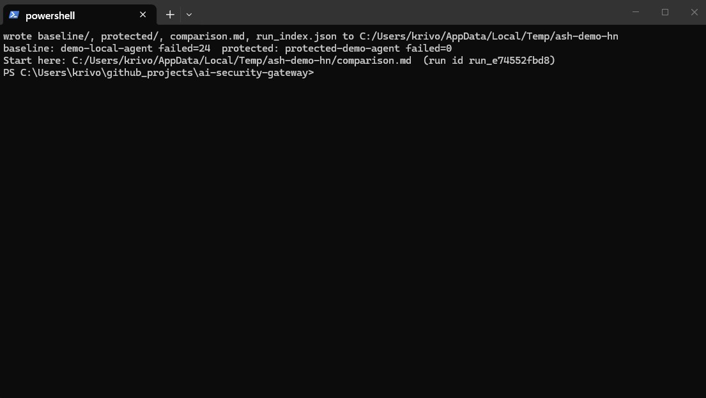
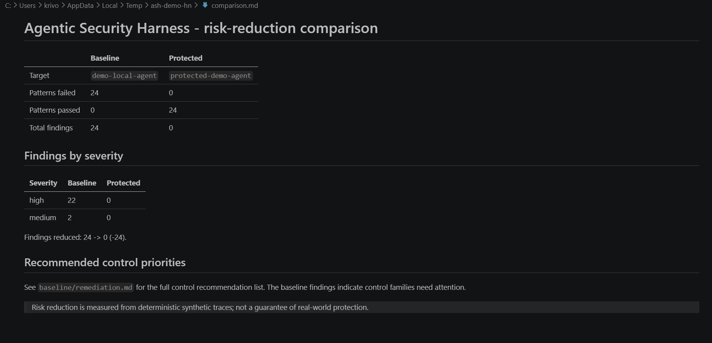
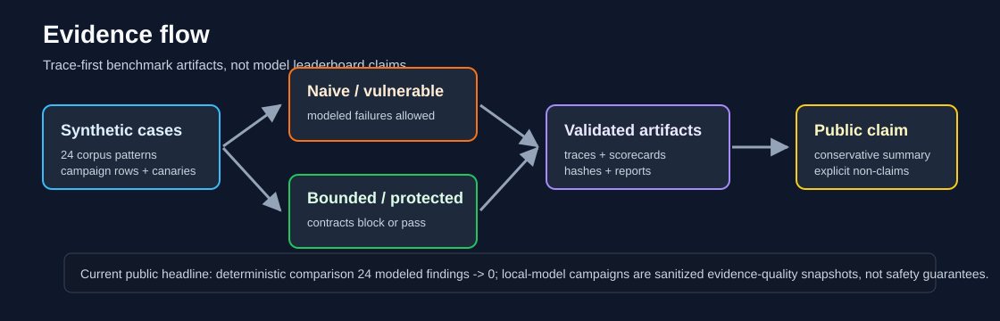

# Agentic Security Harness

[](https://www.bestpractices.dev/projects/13320)
[](https://github.com/krivonosoff161/agentic-security-harness/actions/workflows/ci.yml)
[](https://github.com/krivonosoff161/agentic-security-harness/actions/workflows/codeql.yml)


**Your AI coding agent reads untrusted repository text. Can it keep data separate from
instructions and authority?**

Agentic Security Harness is a local, trace-first benchmark for defensive testing of
agentic AI boundary failures. It runs reproducible synthetic scenarios, records portable
traces and scorecards, and compares a deliberately vulnerable local agent with a protected
one.

In plain English: it turns “the agent behaved unsafely” into evidence you can replay,
validate, compare, and review.

## Quickstart

Install the exact package version from PyPI after confirming that the public index lists
`1.4.0`:

```bash
python -m pip install agentic-security-harness==1.4.0
ash quickstart --out reports/quickstart
ash agent-host-quickstart --out reports/agent-host-quickstart
```

For source development:

```bash
git clone https://github.com/krivonosoff161/agentic-security-harness.git
cd agentic-security-harness
python -m pip install .
ash quickstart --out reports/quickstart
ash agent-host-quickstart --out reports/agent-host-quickstart
```

`ash quickstart` is local and no-network. It runs the same stable 24-pattern corpus against
both demo targets, validates the generated artifacts, and renders a self-contained HTML
report.

`ash agent-host-quickstart` is the shipped provider-neutral integration path in v1.1.0.
It runs a built-in owned synthetic workflow through the
instrumented collector, canonical recordings, deterministic evaluator, atomic bundle
publication, and shared validator. It retains digest-only public evidence and makes no
provider call.

### Runtime Gateway synthetic contour

The source tree now also contains a runnable local Runtime Gateway increment. It applies a
closed policy before synthetic tool dispatch, exposes bounded OpenAI-compatible and MCP
2026-07-28 stateless development endpoints, and maintains a privacy-minimized append-only
audit chain:

```bash
ash gateway-init --out gateway.toml
ash gateway-check --config gateway.toml
ash gateway-serve --config gateway.toml
```

Open <http://127.0.0.1:8787/dashboard> after startup, or use the hardened Docker Compose
profile in [Runtime Gateway synthetic contour](docs/runtime-gateway.md). This is a
credential-free synthetic integration surface. Offline
[provider-neutral tool-call adapters](docs/provider-tool-adapters.md) normalize retained
OpenAI Responses, Anthropic Messages, Google Interactions, and MCP payloads through the
same policy without SDKs or credentials. Live provider transport and a production firewall
are still not shipped. The gateway exposes its exact closed policy and non-executable
approval-request digests; it intentionally has no approval-grant endpoint yet.

### Ecosystem map

Harness is the released core and the public contract owner for a modular security
ecosystem. Transfer verification, handoff safety, playbooks, routing, filtering, private
Runtime Guard research, and the public profile keep their own source-owned component
facts. The Harness generates only the cross-project roadmap and compatibility view:

- [Ecosystem roadmap](docs/ecosystem-roadmap.md)
- [Components and current integration status](docs/ecosystem-components.md)
- [Documentation crosswalk](docs/documentation-map.md)
- [`component.yaml`](component.yaml) and [`ecosystem/roadmap.yaml`](ecosystem/roadmap.yaml)

Runtime Guard remains private and `contract_only`. Harness package source `v1.4.0`
contains the closed [Extension SDK V1](docs/extension-sdk.md) and public passive extras for
validated observation-to-finding dataflow. It does not auto-load installed packages;
companion repositories remain optional, separately versioned distributions.

Package source `v1.4.0` defines closed optional-dependency groups for the installable
public module set:

| Extra | Exact companion distributions | Automatic activation |
|---|---|---|
| `transfer` | `agentic-transfer-verifier==0.2.1`, extension `==1.0.1` | no |
| `handoff` | `ai-agent-handoff==0.3.0`, extension `==1.0.0` | no |
| `playbooks` | `llm-safety-playbooks==0.1.0` data-only wheel | no |
| `router` | `agentic-llm-router==0.2.0` | no |
| `filter` | `llm-cheap-filter==0.2.0` | no |
| `all` | the exact union of the five rows | no |

The generic PyPI coordinate `llm-router` is intentionally absent because it belongs to
another project. CI builds all eight exact wheels from pinned Git SHAs and installs the
closed local wheelhouse without loading either extension entry point. The public install
commands are
`pip install "agentic-security-harness[router]==1.4.0"` or
`pip install "agentic-security-harness[all]==1.4.0"`. Both commands were verified in
fresh isolated environments against PyPI only.

The published [Corpus Pack SDK V1](docs/corpus-pack-sdk.md) adds a separate,
canonical registry for optional namespaced boundary-invariant metadata. It preserves the
frozen corpus 1.0.0, loads no package code, and treats complete evidence as readiness for
later rule evaluation rather than a security verdict.

The published v1.3.0 [companion adapter contracts](docs/companion-extensions.md) exercise
exact Transfer Verifier reports, Handoff metadata and Playbooks guidance through that
SDK on Linux and Windows. This closes a concrete producer-to-consumer dataflow gap; it
does not auto-load those installed distributions or make them production enforcement.

The published v1.3.0 [Security Intelligence contour](docs/security-intelligence-extension.md)
adds a provider-neutral offline weekly public-source review contract with digest-only
evidence, explicit coverage gaps, and no live fetching or model authority.

The published v1.3.0 [receipt auditors](docs/receipt-auditor-extensions.md)
independently checks exact-pinned Router invocation and Cheap Filter triage accounting
receipts from caller-supplied canonical bytes. Valid accounting remains `inconclusive`,
missing evidence remains `inconclusive`, and drift becomes a finding; the auditors never
emit `pass`, import or invoke the companion packages, or lower a security decision.

The published [Extension Distribution Discovery V1](docs/extension-distribution-discovery.md)
inspects one explicitly named local distribution without importing it. It verifies its
`RECORD`, closed entry point, canonical manifest, implementation bytes and caller-supplied
configuration digest, then requires exact reinspection before issuing an authority-free
approval receipt. Harness still does not load package code: the operator supplies an
already constructed object, and the binder checks it against the approved manifest pins.

The published [Extension Operator Lifecycle V1](docs/extension-operator-lifecycle.md)
exposes that metadata-only inspection and exact-reinspection approval through safe CLI
commands, adds canonical disable and non-executable rollback-plan receipts, and lists only
explicitly supplied receipt state. It never imports, downloads, starts, stops, or rolls
back extension code; the embedding application must construct and bind an object and
enforce any accepted disable artifact.

The published [controlled local adapter](docs/controlled-local-adapter.md)
connects only to an operator-started literal-loopback `/v1/responses` endpoint and passes
canonical tool calls through the existing closed Runtime Gateway policy. It supports local
model names as opaque identifiers—including Qwen and DeepSeek-style names—without vendor
claims. It has no DNS, proxy, redirect, credential, external-provider, arbitrary-tool, or
upstream-MCP path; receipts are digest-only and operational authority remains `none`.

The published [Policy Pack extension](docs/policy-pack-extension.md) independently
parses one exact-pinned data-only Playbooks pack and evaluates caller-supplied content-free
signals bound to canonical observations. A missing pack is inconclusive; production
Harness does not import or execute Playbooks code, discover packages, call a network, or
grant allow/enforcement authority.

| Target | Modeled findings | Patterns passed |
|---|---:|---:|
| `demo-agent` | 24 | 0 |
| `protected-demo-agent` | 0 | 24 |

The deterministic result is **24 modeled findings** for the vulnerable fixture and
**0 modeled findings** for the protected fixture. This is synthetic conformance evidence,
not a production safety claim.





Inspect the committed before/after example in
[`examples/comparison-report/`](examples/comparison-report/) or validate every public
example locally:

```bash
ash validate examples/
ash validate docs/evidence-status-registry.json
```

## What this is / is not

| This project is | This project is not |
|---|---|
| A reproducible benchmark for agent operating-environment boundaries. | A production safety certification. |
| A synthetic and authorized defensive testing lab. | A live exploitation or persistence toolkit. |
| A way to compare vulnerable and protected targets using portable artifacts. | Proof that a provider, model, or deployed agent is secure. |
| A stable trace/corpus contract with machine-readable validation. | A model leaderboard or CVE database. |

The benchmark focuses on agent operating-environment boundaries, not just standalone model answers.
Built-in targets are deterministic and offline. The experimental external adapter
is explicit opt-in, prompt-only, and does not execute tools. See
[`docs/benchmark-semantics.md`](docs/benchmark-semantics.md) and
[`docs/authorized-testing-paths.md`](docs/authorized-testing-paths.md).

## Visual evidence snapshot



The public evidence map separates deterministic executable specifications, sanitized local
observations, historical material, and independently reviewed evidence:

- [Evidence map](docs/showcase/evidence-map.md)
- [Evidence classes](docs/evidence-classes.md)
- [Machine-readable evidence registry](docs/evidence-status-registry.json)
- [Evidence pack format](docs/evidence-pack-format.md)
- [Private/public evidence boundary](docs/private-public-evidence-boundary.md)

Public artifacts may include scenario identifiers, aggregate counts, response hashes, and
validator results. They do not include raw private prompts, raw responses, synthetic
canaries, or local paths. Keep external raw material under
`.internal/external-demo/latest`. **Do not** commit `raw_responses/` or other private
runtime evidence.

## Current stable surface

- Trace schema `1.0`, with a bounded legacy `0.1` read/migration window.
- Corpus `1.0.0`, freezing 24 ordered synthetic pattern identifiers.
- Local targets for vulnerable/protected agent, RAG, tool, function, and multi-agent
  handoff comparisons, including `toy-multi-agent` and `protected-toy-multi-agent`.
- JSON traces, scorecards, run manifests, remediation, Markdown reports, and
  self-contained HTML reports.
- Deterministic validators for artifact integrity and declared benchmark semantics.
- Linux/Python 3.11-3.13 as the primary installed-package contour, with Windows 3.11
  compatibility coverage.
- Reproducible wheel/sdist builds, checksums, GitHub attestations, and exact-subject
  CycloneDX SBOMs for public releases from `v1.0.0` onward.
- A shipped provider-neutral Agent Host V1 contour for canonical,
  authority-free record/replay, deterministic evaluation, explicit Python instrumentation,
  and a validated 48-case no-network quickstart. The CLI does not execute arbitrary hosts
  or tools and does not authenticate its producer or certify an external system; see
  [Agent Host Adapter SDK](docs/agent-host-adapter.md).
- A shipped local Runtime Gateway synthetic contour with closed pre-dispatch policy,
  bounded OpenAI-compatible and stateless MCP endpoints, deterministic synthetic tools,
  privacy-minimized hash-chain audit, dashboard, and hardened source-build Docker Compose.
- Credential-free retained-envelope normalization for OpenAI Responses, Anthropic
  Messages, Google Interactions, and MCP tool calls. These adapters do not make provider
  calls or grant tool-execution authority.

The exact shipped, experimental, planned, and historical surfaces live in
[`docs/current-state.md`](docs/current-state.md) and
[`docs/capability-matrix.md`](docs/capability-matrix.md). Technical v1 gates and honest
non-claims are in [`docs/v1-readiness.md`](docs/v1-readiness.md).

## If you only have one minute

- Run the no-network demo above.
- Read the [committed comparison](examples/comparison-report/README.md).
- Browse the [showcase](docs/showcase/index.md) and
  [scenario matrix](docs/showcase/scenario-matrix.md).
- See [weak spots and findings](docs/showcase/weak-spots-and-findings.md).
- Check [current state](docs/current-state.md) and the
  [project tracker](docs/project-tracker.md).
- Bring your own local or OpenAI-compatible model through
  [Run your model](docs/run-your-model.md).

## Use your own model or runtime

The shortest cross-platform operator path is
[`docs/run-your-model.md`](docs/run-your-model.md). It covers:

1. a no-model deterministic demo;
2. one explicitly authorized OpenAI-compatible model;
3. a deterministic local swarm comparison;
4. a bounded local-model mini-swarm campaign.

Connection details and scenario selection are documented in
[`docs/connect-models.md`](docs/connect-models.md) and
[`docs/test-your-model.md`](docs/test-your-model.md). External runs are prompt-only
self-report checks unless a separately reviewed host/tool adapter exists. A coherent answer
is not evidence of safe tool execution.

## Benchmark and evidence documentation

Start with the curated [documentation map](docs/README.md) if you are not sure which
contract, operator guide, or research page applies to your task.

The README is the front door; deeper contracts live in `docs/`:

| Question | Source of truth |
|---|---|
| What is shipped now? | [Current state](docs/current-state.md) |
| What work is open? | [Project tracker](docs/project-tracker.md) and [roadmap](docs/roadmap.md) |
| Which testing paths are authorized? | [Authorized testing paths](docs/authorized-testing-paths.md) |
| Which system shapes are evaluated? | [Evaluation topologies](docs/evaluation-topologies.md) |
| What boundary model is used? | [Agentic boundary model](docs/agentic-boundary-model.md) |
| How is the corpus expanded? | [Corpus expansion plan](docs/corpus-expansion-plan.md) |
| What do metrics mean? | [Metric contract](docs/metric-contract.md) |
| How are scenarios sequenced? | [Scenario timeline](docs/scenario-timeline.md) |
| How should reports be showcased? | [Showcase checklist](docs/showcase-report-checklist.md) |
| How is evidence promoted? | [Evidence pack format](docs/evidence-pack-format.md) |
| How are changes reviewed? | [Git evidence workflow](docs/git-evidence-workflow.md) |
| How can an external agent host record and evaluate observations? | [Agent Host Adapter SDK](docs/agent-host-adapter.md) |
| How can I run the local policy gateway and MCP/OpenAI-compatible demo? | [Runtime Gateway synthetic contour](docs/runtime-gateway.md) |
| How are provider tool-call envelopes normalized without credentials? | [Provider-neutral tool-call adapters](docs/provider-tool-adapters.md) |
| How do optional components exchange validated observations and findings? | [Extension SDK V1](docs/extension-sdk.md) |
| How is an installed extension distribution verified before explicit registration? | [Extension Distribution Discovery V1](docs/extension-distribution-discovery.md) |
| How does an operator approve, list, disable, or plan rollback without automatic code loading? | [Extension Operator Lifecycle V1](docs/extension-operator-lifecycle.md) |
| Which companion contracts already have executable cross-repository adapters? | [Companion Extension adapters](docs/companion-extensions.md) |
| How are weekly public security inputs reviewed without provider lock-in? | [Security Intelligence extension](docs/security-intelligence-extension.md) |
| How can optional packages add patterns without overriding the stable corpus? | [Corpus Pack SDK V1](docs/corpus-pack-sdk.md) |
| How can an operator connect one local model without opening arbitrary tools? | [Controlled local provider/tool-host adapter](docs/controlled-local-adapter.md) |
| How is the reviewed Playbooks Policy Pack evaluated without importing its code? | [Policy Pack V1 extension](docs/policy-pack-extension.md) |

Specialized reviewer paths:

- [Local Prometheus workflow](docs/local-prometheus-workflow.md)
- [Local model profiles](docs/local-model-profiles.md)
- [Multi-agent handoff toy topology](docs/handoff-toy-topology.md)
- [Security audit causal map](docs/security-audit-causal-map-2026-07-15.md)
- [R5 sanitized research status](docs/r5-research-status.md)
- [Project governance](GOVERNANCE.md)

## Standards and portfolio boundaries

The project publishes conservative mappings to OWASP LLM, NIST, and a direct-fit MITRE
ATLAS subset in [`docs/standards-mapping.md`](docs/standards-mapping.md). These are
maintainer-reviewed mappings, not certification or independent standards validation.
Independent review remains public follow-up work.

The related public contract includes:

- [Threat ontology](docs/threat-ontology.md): 26 provider-neutral failure families.
- [Scenario adjudication ledger](docs/scenario-adjudication-ledger.md): 127 bounded source
  units from 13 enumerated builders.
- [Unified event envelope](docs/unified-event-envelope.md): separation of observations,
  data, authority, advisories, decisions, and effects.

The 127 units are **not 127 canonical attacks** and **not a repository-wide total**. The
contract grants no executor, provider, deployment, enforcement, or production authority.

## Public security stack

Agentic Security Harness is the benchmark/evidence layer in a small public defensive
stack:

```text
llm-safety-playbooks -> ai-agent-handoff -> agentic-transfer-verifier -> agentic-security-harness
```

- [`llm-safety-playbooks`](https://github.com/krivonosoff161/llm-safety-playbooks)
  documents practical boundary rules.
- [`ai-agent-handoff`](https://github.com/krivonosoff161/ai-agent-handoff)
  represents task briefs and handoff state as reviewable files.
- [`agentic-transfer-verifier`](https://github.com/krivonosoff161/agentic-transfer-verifier)
  checks provenance, authority, approval, and audit evidence around transfers.
- This repository measures modeled failures and produces validated benchmark artifacts.

The repositories are related but not interchangeable. A playbook is not a runtime control,
a handoff file is not a sandbox, and a passing benchmark is not a production certificate.
The review-only [ecosystem integration candidate](docs/ecosystem-integration-candidate.md)
builds the optional Transfer and Handoff extension wheels and exercises their explicit
approval lifecycle on Ubuntu and Windows; it does not bundle or auto-install them.

## Release and package status

Package source `v1.4.0` is configured for the repository's tag-only attested release and
OIDC promotion workflows. Availability is established only by the exact
[PyPI project history](https://pypi.org/project/agentic-security-harness/#history) and
[GitHub Releases](https://github.com/krivonosoff161/agentic-security-harness/releases),
not by source metadata alone. Publication makes the bounded core and selected passive
distributions installable; it is not automatic activation, production deployment,
enforcement, provider authority, or security certification.

- [Release checklist](docs/release-checklist.md)
- [PyPI release process](docs/release-to-pypi.md)
- [Changelog](CHANGELOG.md)
- [Security policy](SECURITY.md)

Independent standards review and a durable second GitHub reviewer are transparent
post-v1 credibility tasks. Their absence does not change deterministic test results, but
independent review is not claimed.

## Development

```bash
python -m pip install -e ".[dev]"
python -m pytest
python -m ruff check .
python -m mypy src tests tools
ash validate examples/
```

Development follows
`idea -> issue -> branch -> implementation -> tests/artifacts -> PR -> GitHub checks -> review gate`.
See [`docs/git-evidence-workflow.md`](docs/git-evidence-workflow.md),
[`CONTRIBUTING.md`](CONTRIBUTING.md), and [`docs/agent-operating-guide.md`](docs/agent-operating-guide.md).

## Responsible use

Use only synthetic, local, owned, or explicitly authorized targets. Do not use this project
for credential theft, persistence, evasion, destructive payloads, or unauthorized systems.
See [`SECURITY.md`](SECURITY.md) and
[`docs/authorized-testing-paths.md`](docs/authorized-testing-paths.md).

## Citation, contributing, and license

- Citation metadata: [`CITATION.cff`](CITATION.cff)
- Governance: [`GOVERNANCE.md`](GOVERNANCE.md)
- Contributing: [`CONTRIBUTING.md`](CONTRIBUTING.md)
- Support: [`SUPPORT.md`](SUPPORT.md)
- License: Apache-2.0, see [`LICENSE`](LICENSE) and [`NOTICE`](NOTICE)
