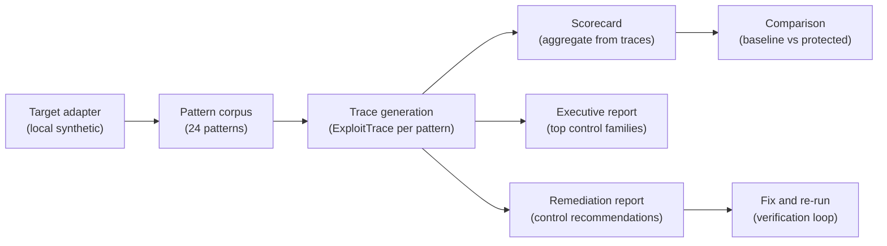
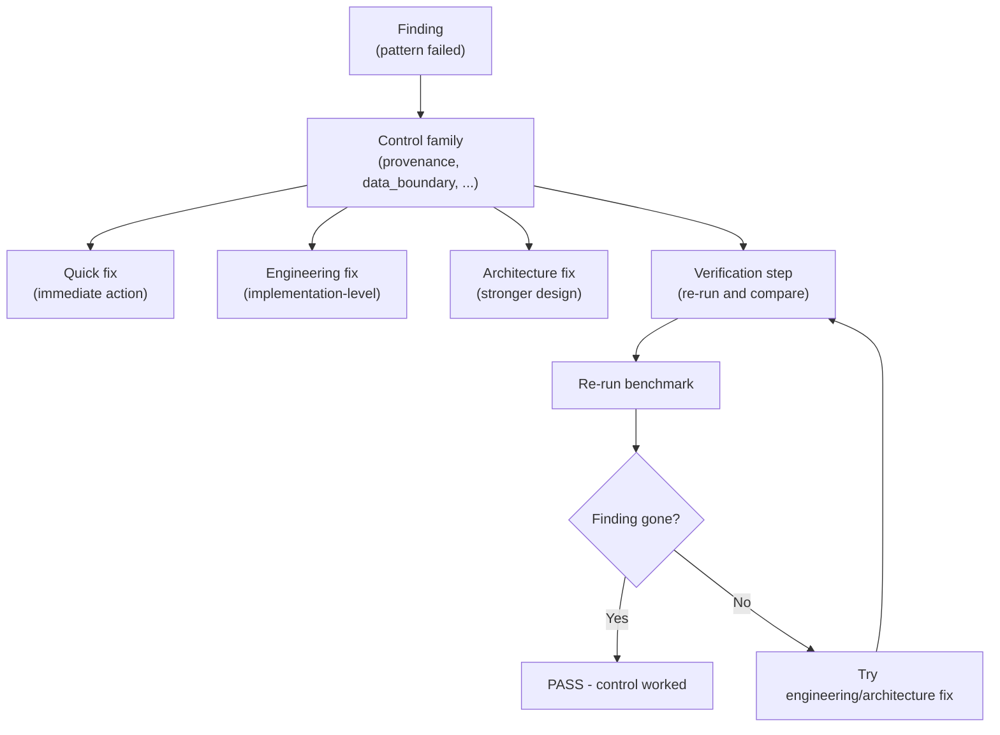
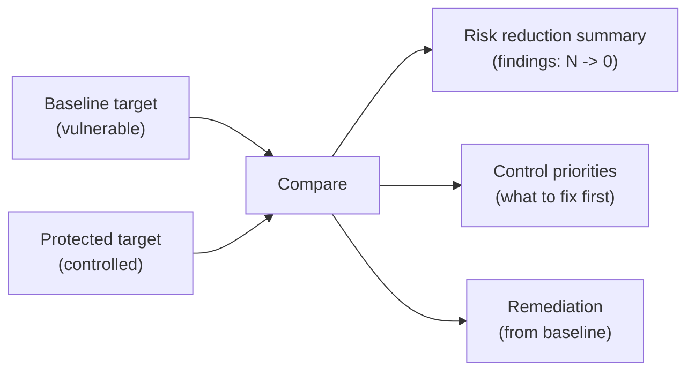
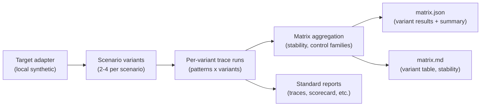

# Reporting flow

> **Agentic Security Harness.** This page visualizes how the benchmark runs, how reports
> are generated, and how remediation recommendations flow back into target improvement.

## Benchmark flow

**What happens at each step:**

1. **Target adapter** drives the agent through each pattern scenario.
2. **Pattern corpus** provides 24 deterministic synthetic test patterns.
3. **Trace generation** produces one `ExploitTrace` per pattern - portable, machine-readable.
4. **Scorecard** aggregates findings by severity, counts failed/passed patterns.
5. **Executive report** summarizes scope, headline result, and top control families.
6. **Remediation report** maps findings to control families with fix recommendations.
7. **Comparison** replays the same corpus against a protected target and measures reduction.
8. **Fix and re-run** - the verification loop: implement a control, re-run, compare.

## Control recommendation flow

**Control families in the current corpus:**

| Family | What it covers |
|---|---|
| `provenance` | Source provenance tracking and propagation |
| `data_boundary` | Data envelope enforcement across handoffs |
| `memory_governance` | Memory provenance, trust levels, TTL, scope isolation |
| `tool_selection` | Tool intent validation, schema provenance, selection integrity |
| `capability_control` | Capability tokens, delegation bounds, ambient authority |
| `approval_context` | Approval request completeness, informed consent |
| `audit_completeness` | Audit trail integrity, completeness, tamper-evidence |
| `budget_control` | Step budgets, recursion depth, loop guards |
| `perception_boundary` | Perception-channel trust, provenance tagging |
| `provider_boundary` | Provider egress gating, redaction |
| `adapter_metadata` | Adapter reproducibility metadata |

## Target comparison flow

**What the comparison shows:**

- **Baseline** - how many patterns failed, at which break points, with what severity.
- **Protected** - how many patterns pass after controls are applied.
- **Reduction** - the measured delta (e.g. "24 -> 0").
- **Control priorities** - which control families the baseline findings indicate.

## Report artifact summary

| Artifact | Format | Content | When generated |
|---|---|---|---|
| `traces.json` | JSON | Portable failure traces (one per pattern) | Always |
| `scorecard.json` | JSON | Aggregate: findings by severity, failed/passed | Always |
| `summary.md` | Markdown | Human-readable pattern table | Always |
| `executive.md` | Markdown | Executive view: scope, result, control families | Always |
| `remediation.json` | JSON | Structured control recommendations | When findings exist |
| `remediation.md` | Markdown | Human-readable remediation report | When findings exist |
| `comparison.md` | Markdown | Baseline vs protected risk reduction | `ash compare` only |
| `matrix.json` | JSON | Variant metadata, stability analysis, aggregated summary | `ash run-matrix` only |
| `matrix.md` | Markdown | Variant table, pattern stability, control families | `ash run-matrix` only |
| `run_config.json` | JSON | External run config incl. pre-request `execution_id` and `request_count`; credential marker only | `ash run-external` only |
| `external_results.json` | JSON | Per-request normalized results with structured errors and the same execution id | `ash run-external` only |
| `external_summary.json` | JSON | Execution-bound pass/finding/inconclusive/flaky + `findings_by_control_family` | `ash run-external` only |
| `external_report.md` | Markdown | Human report: config, results, control-family table, control recommendations | `ash run-external` only |
| `adapter-metadata.json` | JSON | Runtime reproducibility metadata | Future (non-synthetic adapters) |

## Matrix flow

**What the matrix shows:**

- **Variant results** - which variant knobs were tested, findings per variant.
- **Pattern stability** - which patterns fail in every variant (stable_fail),
  which fail only under some variants (variant_sensitive), and which pass.
- **Control families** - which families appear across variants, with counts.

In the current release, variant knobs are deterministic replay metadata. They make the
matrix report useful for grouping and aggregation, but they do not mutate underlying
pattern content yet.

## How to interpret the output

### If you see FAIL patterns

1. Open `remediation.md` - it tells you what control family is missing.
2. Check the **quick fix** - can you implement it immediately?
3. If not, check the **engineering fix** - what implementation change is needed?
4. For deeper issues, check the **architecture fix** - what stronger design is recommended.
5. Follow the **verification step** - re-run the benchmark to confirm.

### If you see all PASS

1. The protected target passed all 24 patterns.
2. This means the controls are working for the **deterministic synthetic scenarios** tested.
3. It does **not** guarantee real-world protection - stochastic models, real providers,
   and production environments introduce additional risk.
4. Check `residual risk` in the remediation report for what remains.

### If you compare baseline vs protected

1. The comparison shows the measured risk reduction.
2. The **control priorities** section tells you what to fix first.
3. Re-run after implementing fixes to verify improvement.
