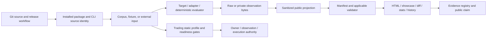

# Security Audit Causal Map

Date: 2026-07-15
Status: active authorized audit map, remediation blocked on owner authority; not a completion or security-certification claim.

## Scope And Authority

This map covers the registered `agentic-security-harness-evidence-repair` worktree and the
registered trading target as a read-only static reference. It joins the 50 code-verified findings
in `TASK.md` to the complete evidence path from repository entry to reviewer claim.

No trading target module, provider, private endpoint, local model, Telegram path, benchmark
campaign, or live process was executed. MiMo and agent reports are proposal evidence only;
deterministic code, validators, tests, persisted artifacts, and primary sources own conclusions.

## End-To-End Trust Path

The critical rule is monotonic trust: a downstream stage may reduce authority or mark evidence
inconclusive, but it may not invent origin, owner approval, independent labels, private-byte
reconciliation, causal independence, trusted time, or execution isolation.

## What Each Evidence Surface Actually Proves

| Surface | Current strongest support | Explicitly not proved |
|---|---|---|
| Deterministic examples | Current producer/validator consistency for the declared synthetic corpus and rule-derived controls. | Real-model safety, causal effectiveness, exhaustive coverage, or production safety. |
| Current content-bound manifests | Exact persisted-byte inventory plus applicable semantic reconstruction. | Authorship, trusted time, endpoint/model identity, or protection from coordinated rewrite. |
| Legacy local-model examples | Historical structural declarations and, where present, unreconciled detector summaries. | Current execution, retained private-byte equality, detector accuracy, or locality. |
| Private/public reconciliation receipt | Owner-side exact persisted-byte commitment, complete declared matrix, producer-stage/hash contract, and exact public projection for five supported campaigns. | Public replay of private bytes, authorship, trusted time, endpoint/model/implementation identity, detector correctness, or semantic truth. |
| Static trading closure | Hash-bound batch/import topology over 189 observed files plus phased configuration/provider/network/delivery/exchange/storage inventory without importing target code. | Cross-branch runtime ordering, configured reachability, execution isolation, or behavior at runtime. |
| Filled trading fixture rows | Self-declared shape accepted by the private validator. | Real target observation or owner authorization without separate receipts. |
| Current signed evidence | None. | No row may claim `signed_attested`. |
| Current empirical campaign | None under a newly authorized current schema. | Historical runs cannot be promoted by documentation or rehashing. |

## Finding-By-Finding Closure Ledger

`Repaired` means the verified causal path is closed for the stated safe slice. It never means
that the whole project or an external target is secure.

| Finding | Layer | Current closure | Remaining proof or authority |
|---|---|---|---|
| `TB-AUD-01` | Trading process boundary | Open in read-only target: canonical preflight and journal imports can load environment state. | Target development branch; remove import-time loading; load-attempt canary over full entrypoint. |
| `TB-AUD-02` | Trading scientific validity | Open in read-only target: historical forward-ready rows lack implementation identity/expiry. | Versioned validation manifest and mismatch/expiry revalidation in target. |
| `TB-AUD-03` | Trading simulator | Open in read-only target: same-candle entry/stop/take ordering is optimistic/unknowable. | Conservative or lower-timeframe policy plus four intrabar controls. |
| `TB-AUD-04` | Trading simulator | Open in read-only target: complete-bar signal can be filled at that bar's open. | Next-bar/post-close execution model with decision/fill timestamps. |
| `TB-AUD-05` | Trading artifact authority | Open in read-only target: mutable request/report/card/SQLite state is mutually trusted. | Atomic cross-binding, freshness/revocation, and selected trust root. |
| `TB-AUD-06` | Trading confidentiality | Open in read-only target: role reviews and remote provider are default-enabled; field selection is not DLP. | Local/off default, export consent, destination and content/size policy. |
| `TB-AUD-07` | LLM-to-compute authority | Open in read-only target: accepted review dimensions can enqueue bounded work before final evidence. | Recursive schema plus deterministic pre-enqueue policy. |
| `TB-AUD-08` | Trading audience authority | Open design risk: subscriber path accepts PFR and broader farm-calculated rows. | Separate queues or explicit non-PFR audience opt-in. |
| `TB-AUD-09` | Trading replay/freshness | Open in read-only target: snapshots lack generation binding and runtime expiry enforcement. | Atomic generation-bound snapshot, monotonic sequence, source hash, crash/replay tests. |
| `TB-AUD-10` | Local calculator intake | Open in read-only target: latest-path index is trusted without recomputing packet identity. | Resolved containment, link refusal, content identity, freshness and schema gates. |
| `TB-AUD-11` | Trading availability | Open in read-only target: journal import can terminate outside the loop's normal error path. | Lazy dependency check returning a stage error. |
| `ASH-TB-01` | Auditor credibility | Repaired for the authorized static slice: causal identity joins, phased transitive authority inventory, reparse-safe paths, source hashes, and fail-closed readiness replace file-presence/pass constants. | Cross-branch call ordering is manually traced but not generically proved; runtime configuration, execution isolation, and independent receipts remain unverified. |
| `ASH-AUD-02` | Private/public empirical binding | Partially repaired: five current campaign families have an owner-side exact-byte HMAC receipt, complete declared-matrix checks, producer-stage/hash validation, exact public projection, and explicit public/private replay separation. | Retained schemas do not contain enough independent inputs to replay detector/canary semantics; the unsigned receipt does not authenticate origin, locality, implementation, or model identity. |
| `ASH-AUD-03` | Private hash reproducibility | Fail-closed at reconciliation: a persisted private response whose bytes no longer match the public response hash cannot receive a receipt. | Producers should still canonicalize/persist before hashing; separately designed encrypted raw forensics remains an authority decision. |
| `ASH-AUD-04` | Independent-label authority | Fail-closed classification exists, but arbitrary hash-shaped review evidence is not independently authenticated. | Canonical review receipt, observation binding, reviewer identity and trust root. |
| `ASH-AUD-05` | Private containment | Trading fixture writer subset repaired by `ASH-AUD-31`; raw live/private writers remain guarded. | One approved resolved-root primitive inside every raw private writer plus link/junction controls. |
| `ASH-AUD-06` | Empirical execution identity | Current live producers carry pre-request identity/fingerprint, and reconciliation binds the exact declared private/public identity fields for retained current-schema bytes. Legacy evidence is not upgraded. | Fresh authorized execution plus independent endpoint/model/implementation attestation is required for an empirical identity claim. |
| `ASH-AUD-07` | Corpus authority | Repaired for current deterministic shipped profiles; custom and legacy classes remain explicit. | External trust anchor and any future versioned custom-corpus promotion policy. |
| `ASH-AUD-08` | Claim integrity | Repaired wording/counts/classification; a typed unsigned reconciliation receipt now exists for retained current-schema bundles, while historical empirical promotion remains blocked. | Independent labels where claimed, authenticated origin, and a trust root. |
| `ASH-AUD-09` | Assurance self-attestation | Repaired fail-closed: the typed reconciliation receipt is unsigned and the evidence registry still rejects promotion to reconciled/content-bound/signed states without an independently validated assurance policy. | Cryptographic signer/trust-root verification before enabling strong public states. |
| `ASH-AUD-10` | External execution identity | Repaired for current producer: pre-request id, one manifest, exact projection/inventory. | Endpoint/model authorship and guarded raw-response containment. |
| `ASH-AUD-11` | Shipped-corpus downgrade | Repaired: `shipped_full` and `custom_subset` are distinct and validated. | Author-defined scenario coverage is not exhaustive-world evidence. |
| `ASH-AUD-12` | Showcase source authority | Repaired: only applicable-validator-accepted current content-bound sources become cards. | Unsigned source origin. |
| `ASH-AUD-13` | Public persistence bypass | Repaired for public contour output through the central redacting sink. | Guarded raw-private writers are a separate boundary. |
| `ASH-AUD-14` | Documentation promotion | Repaired: docs-only history is `maintainer_declaration_unverified`. | Current result projection and receipt before promotion. |
| `ASH-AUD-15` | Legacy rule-spec promotion | Repaired: legacy semantic rows are historical snapshots, not current executable specs. | Fresh current-schema deterministic build. |
| `ASH-AUD-16` | Validator-anchor semantics | Repaired: anchors are typed routes bound to artifact markers. | Route identity does not authenticate validator source. |
| `ASH-AUD-17` | History/retention consumers | Repaired: current applicable-validator-accepted manifests only. | Authentic origin and transactional local deletion remain separate. |
| `ASH-AUD-18` | HTML reviewer authority | Repaired: source validates before output; tamper/overlap/symlink output fail closed. | Unsigned source identity and browser environment are outside artifact integrity. |
| `ASH-AUD-19` | Evidence-quality derivation | Repaired: manifested validated sources, rebuildable rows/aggregates, exact output. Owner-side private reconciliation is separately available for five campaign families. | Evidence-quality output does not itself perform private replay or authenticate signed origin. |
| `ASH-AUD-20` | Cross-run diff authority | Repaired: same-kind validated inputs, source commitments, exact derivation. | Signed source origin and semantic comparability beyond declared contract. |
| `ASH-AUD-21` | Run-statistics authority | Repaired: portable source commitments and rebuildable content-bound output. | Authenticated source time/origin. |
| `ASH-AUD-22` | Core/matrix manifest authority | Repaired: authoritative inventory and semantic reconstruction are mandatory. | Coordinated rewrite remains possible without external trust root. |
| `ASH-AUD-23` | Stored Markdown/showcase injection | Repaired: context encoders, exact Markdown validation, overlap/link refusal. | Rendering outside supported consumers remains a consumer responsibility. |
| `ASH-AUD-24` | Trading public projection | Repaired: allowlists, constant redaction, sanitized-projection digest, no private-file fingerprint. | The five-campaign reconciliation contract does not cover trading fixtures; public projection still does not prove private retention or authorship. |
| `ASH-AUD-25` | Trading observation/approval/TOCTOU | Repaired fail-closed: self-declared rows, false generated approval, parse-once/hash-recheck. | Separate action-bound observation and owner receipts. |
| `ASH-AUD-26` | Terminal/reviewer control injection | Repaired: Markdown contexts plus ANSI/OSC/C0/C1/CR/bidi neutralization. | Unsupported third-party renderers must apply equivalent policy. |
| `ASH-AUD-27` | Canonical trading entrypoint closure | Repaired for static evidence: topology and analyzer source are hash-bound; literal dynamic targets remain fail-closed; configuration/provider/network/delivery/exchange/storage/process/dynamic-code sites are phased and traced, including direct-import aliases; reparse traversal is rejected; readiness consumes `security_clear=false`. | Generic cross-branch ordering and runtime configuration/provider/messaging/execution attestations remain unproven by static evidence. |
| `ASH-AUD-28` | Retention chronology | Repaired fail-closed: unsigned chronology is explicit and separately accepted. | Signed/append-only trusted-time authority. |
| `ASH-AUD-29` | Forged/stale retention plan | Repaired: exact fresh-plan rebuild, identity binding and immediate candidate recheck. | Filesystem deletion is not transactional under an adversarial concurrent writer. |
| `ASH-AUD-30` | Release/evidence authenticity | Design corrected and verified against current GitHub, Sigstore, and SLSA v1.2 primary documentation: exact subject plus allowed workload/signer identity and `builder.id` pair, maximum trusted level, predicate/parameter policy, and public/private transparency distinction. Implementation remains intentionally blocked. | Owner chooses signer/disclosure/workflow policy and authorizes external attestation permissions. |
| `ASH-AUD-31` | Trading private writer containment | Repaired for ten fixture writers: contiguous root, prospective resolution, parent recheck, exclusive create. | Git-ignore status outside repo and OS-specific ancestor-swap hardening. |
| `ASH-AUD-32` | Retention output confidentiality | Repaired: absolute paths remain internal to apply while normal text/JSON uses `<run-root>` and relative candidates. | Diagnostic errors and other explicitly local CLI surfaces require their own disclosure decisions. |
| `ASH-AUD-33` | Release workflow identity/gates | Repaired: tag-only canonical version binding, repository gates, both distribution smokes, no persisted checkout credential, unsigned checksums. | Artifacts remain unsigned; repository settings and the separate cross-platform CI result are not cryptographically bound. |
| `ASH-AUD-34` | Docker build-context confidentiality | Repaired fail-closed: the root context starts ignored, re-allows only exact public application and ClusterFuzz build inputs, and re-denies private-name descendants after public-tree rules; a contract test enforces ordering without reading private contents. | An allowlisted public tree still depends on private generators honoring their designated nested roots; the application image was not built locally, while GitHub CI exercises the ClusterFuzz context. |
| `ASH-AUD-35` | Container source identity/status | Repaired: source path precedes smoke import and docs distinguish the local CLI image definition from the planned gateway. | No image build was run; build inputs are covered by the static packaging contract. |
| `ASH-AUD-36` | GitHub Actions checkout credential | Repaired: all five checkouts disable persisted credentials; every action reference is contract-tested as a full commit SHA. | Hosted-runner/action trust and repository Actions settings remain external. |
| `ASH-AUD-37` | External-model execution authority | Repaired: `run-external` defaults to no-network/no-files preview; only `--execute` reaches model requests and writes, and all runnable docs choose a mode. | Direct Python API use is explicit caller authority; `external-check --live` is a separate one-request opt-in. |
| `ASH-AUD-38` | Redirected endpoint/credential authority | Repaired: redirect refusal is the client default and all eleven model call sites explicitly require it; an AST contract prevents silent regression. | Ambient proxy routing is closed in `ASH-AUD-39`; DNS/address changes remain separate, and direct API callers can deliberately opt into redirects. |
| `ASH-AUD-39` | Ambient proxy route authority | Repaired: the transport installs an empty proxy handler by default, all model calls explicitly reject ambient proxies, and the direct page fetch does the same. | Direct API opt-in, explicit gateways, DNS/address stability, and TLS trust remain distinct authority controls. |

## Causal Chokepoints

The 50 findings reduce to nine recurring failure mechanisms:

1. **Self-attested authority:** a producer or mutable field claims owner approval, independent
   review, execution identity, or assurance state.
2. **Internal consistency presented as authenticity:** coordinated content plus hash/manifest
   rewrites still pass without an external signer and verification policy.
3. **Projection without public replay:** owner-side reconciliation can bind retained bytes for five families, but public-only validation cannot replay the HMAC/private side or reconstruct missing detector inputs.
4. **Rule-derived behavior presented as empirical causality:** synthetic ablations show encoded
   dependencies, not real-world effect sizes.
5. **Mutable-path time-of-check/time-of-use:** files, roots, snapshots, or plans change between
   validation and consumption/destruction.
6. **Transitive capability blindness:** direct allowlists miss imported provider, configuration,
   messaging, or role-review paths.
7. **Renderer/operator injection:** valid untrusted strings become Markdown or terminal control.
8. **Scientific timing ambiguity:** bar completion, decision availability, fill order, evidence
   expiry, and observation time are conflated.
9. **Implicit side-effect or route authority:** selecting a command/configuration, following a
   redirect, or inheriting ambient routing is treated as consent for additional network, model,
   write, or destructive work without a separate affirmative authority decision.

Primary source anchors for `ASH-AUD-38`: Python documents that its default redirect handler
automatically follows 301/302/303 responses to POST requests, while the
[OWASP SSRF Prevention Cheat Sheet](https://cheatsheetseries.owasp.org/cheatsheets/Server_Side_Request_Forgery_Prevention_Cheat_Sheet.html)
recommends disabling redirect following to prevent validation bypass. See the
[Python `urllib.request` redirect documentation](https://docs.python.org/3/library/urllib.request.html#httpredirecthandler-objects).
Python also documents that `ProxyHandler` reads environment/OS proxy settings by default and that
an empty dictionary disables autodetection; see the
[Python `ProxyHandler` documentation](https://docs.python.org/3/library/urllib.request.html#urllib.request.ProxyHandler).

## Remaining Decision And Execution Order

1. Choose or explicitly reject the artifact trust root in
   `artifact-authenticity-design.md`. This is required before release/evidence origin promotion.
2. Choose the reviewer-receipt trust policy and, separately, grant any raw-private writer
   containment work. The unsigned five-campaign reconciliation contract is implemented; this
   must not be confused with authenticated reviewer origin or permission to read existing private
   artifacts or secrets.
3. Grant a separate target-development branch decision for `TB-AUD-01` through `TB-AUD-11`.
   Static ASH repairs cannot close defects in a read-only target.
4. Only after runtime provider/config/messaging/execution gates are independently evidenced,
   decide whether to authorize one current-schema local campaign.
   Historical evidence and static co-reachability are not substitutes.
5. Keep live trading, private account endpoints, `.env`, Telegram sends, publication, push, and
   merge under their existing independent hard stops.

## Completion Evidence Required

The audit is not complete until every open/partial row above is either repaired and verified or
explicitly accepted as a named residual by the owner. Completion also requires:

- exact registered worktree/branch evidence;
- full current tests, lint, types, artifact validation, schema parse, and diff checks;
- a final private/public and synthetic/empirical reconciliation review (completed for the
  authorized five-campaign owner-side contract, with public replay and semantic/origin limits
  retained);
- no strong evidence-registry state without its independently validated receipt;
- no empirical claim without a newly authorized current-schema execution;
- no claim that static import closure proves runtime isolation;
- no claim that a green validator proves security, semantic truth, or authorship.
